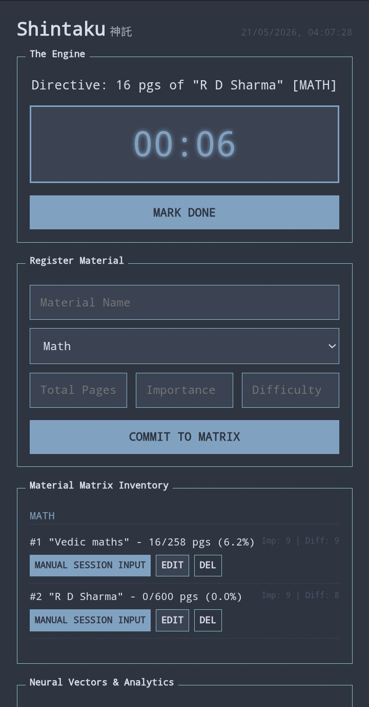

# shintaku

the app stems from my anxiety about what to study. i study one thing and worry about another. local-first study oracle. eliminates decision fatigue on what to study. you input sleep metrics, it calculates biological cognitive capacity. you input syllabus, it assigns exact page counts based on real-time neural alignment. it learns your reading speed. it builds its own graphs. zero external dependencies. zero tracking.

## architecture

* pure javascript.
* semantic html.
* native inline css variables for theming.
* native svg generation for data visualization.
* localstorage database.

  

## the algorithms

shintaku operates on three math engines: circadian alignment, regression-based speed prediction, and a priority scoring matrix.

### 1. epi-circadian engine

humans do not have linear focus. focus is a wave dictated by sleep quality and hours since wake (hsw).

sleep quality ($Q$) is calculated using duration against an 8-hour target, penalized by daytime light exposure (if waking between 10am and 10pm, environmental light degrades rem/deep sleep quality):

$$Q = \min\left(\frac{D_{\text{actual}}}{8.0} \cdot A, 1.2\right)$$

where $A$ is the alignment penalty (0.75 for daytime sleepers, 1.0 for night sleepers).

raw biological alertness ($A_{raw}$) uses an asymmetric bi-bimodal curve. it maps the primary post-wake peak and the secondary evening wind-down:

$$A_{raw} = 0.6 \cdot \sin\left(\frac{\pi \cdot \text{hsw}}{6}\right) + 0.4 \cdot \cos\left(\frac{\pi \cdot \text{hsw}}{12}\right)$$

final cognitive potential ($C_p$) is the product of sleep quality and raw alertness:

$$C_p = A_{raw} \cdot Q$$

### 2. multivariate ordinary least squares (ols) regression

the oracle needs to assign a 45-minute sprint. to do this, it must predict how fast you read specific subjects at specific times of day. brain.js is too bloated. shintaku uses a custom multivariate linear regression model built in 20 lines of vanilla js.

it maps historical data:

* $X_1$: hours since wake
* $X_2$: subject difficulty
* $Y$: seconds per page

it calculates the means ($\bar{x}$, $\bar{y}$) of your historical reading logs for a specific tag.

slope ($B_1$) is calculated via covariance and variance:

$$B_1 = \frac{\sum (X_i - \bar{x})(Y_i - \bar{y})}{\sum (X_i - \bar{x})^2}$$

y-intercept ($B_0$):

$$B_0 = \bar{y} - B_1\bar{x}$$

predicted speed for current session:

$$Y_{predicted} = B_0 + (B_1 \cdot \text{current hsw})$$

if data is scarce (cold start), it uses deterministic fallbacks (e.g., math = 170 secs/page, manga = 35 secs/page).

### 3. oracle priority matrix

when consulted, the oracle scores every incomplete book in your library. highest score wins.

urgency ($U$) scales as you approach completion:

$$U = 1 - \left(\frac{\text{pages completed}}{\text{total pages}}\right)$$

difficulty alignment ($D$) matches the book's difficulty to your real-time brain capacity. hard math aligns with peak $C_p$. light reading aligns with circadian dips.

$$D = 1 - \left| C_p - \frac{\text{difficulty}}{10} \right|$$

total priority score ($P$):

$$P = (Importance \cdot 2.2) + (D \cdot 9) + (U \cdot 4)$$

once a book is selected, the oracle calculates exact page assignment to hit a 45-minute (2700 seconds) target block:

$$\text{Pages} = \frac{2700}{Y_{predicted}}$$

pages are clamped between 1 and 25 to prevent extreme assignments. user clicks start, stopwatch runs, logic repeats.

Inspired by the system-24 theme aesthetics.

## Screenshots

  

## usage
Put all your books in the app, follow its revelation without question

## licenses
Shintaku is being developed under the GPLv3 License.

## follow the development

See my thought process and approach with other's opinions on telegram: <https://t.me/karuifoss>
This app has been primarily made on my phone with Acode editor with alpine linux terminal.

Github Issues are the fastest way to get in touch, for other means there's gitlab, bluesky, and my dev.to account, all linked in my account page on github and [homepage](https://ronynn.github.io).

If you like the app, don't forget to leave a star ⭐ here on github and let me know your suggestions!
